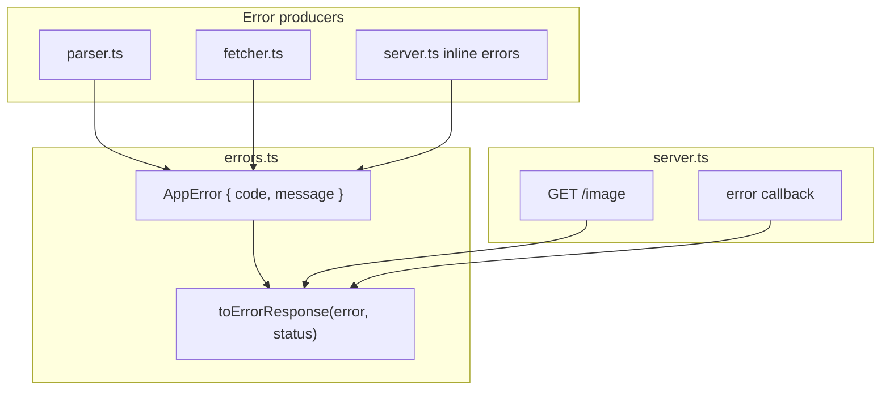

# Standardize API error responses

**Branch:** `feat/standardize-api-errors`

## Target response shape

All API error responses use:

```json
{ "error": { "code": "INVALID_URL", "message": "Valid URL is required" } }
```

Codes are stable identifiers for clients; messages stay human-readable and can vary per case while reusing the same code.

## Architecture



---

## Phase 1 — Core error module

Add [`src/errors.ts`](src/errors.ts):

- `ErrorCode` — const object of string literals (e.g. `INVALID_URL`, `INVALID_WIDTH`, `INVALID_QUALITY`, `SOURCE_FETCH_FAILED`, `SOURCE_UNSUPPORTED_CONTENT_TYPE`, `PROCESSING_TIMEOUT`, `NOT_FOUND`, `INTERNAL_ERROR`)
- `AppError` — `{ code: ErrorCode; message: string }`
- `appError(code, message)` — factory (keeps construction consistent)
- `toErrorResponse(error: AppError, status: number)` — returns `Response.json({ error }, { status })`

No HTTP status mapping table in this module — callers pass status explicitly (keeps existing codes: 400, 403, 408, 404, 500).

---

## Phase 2 — Update error producers

### [`src/parser.ts`](src/parser.ts)

Change result types from `error: string | null` to `error: AppError | null`.

| Code              | Reused for                          | Example messages (from existing Zod schemas)             |
| ----------------- | ----------------------------------- | -------------------------------------------------------- |
| `INVALID_URL`     | missing, malformed, non-http(s)     | `"Valid URL is required"`                                |
| `INVALID_WIDTH`   | missing, not a number, `< 1`        | `"Width must be a number"`, `"Width must be at least 1"` |
| `INVALID_QUALITY` | missing, not a number, out of range | `"Quality must be at least 1"`, etc.                     |

On Zod failure: take `issues[0].message` as message, assign code by which parser ran (not by message string matching). Fallback message: `"Validation failed"` with the field's code if issues array is empty.

### [`src/fetcher.ts`](src/fetcher.ts)

Change `error: string | null` to `error: AppError | null`.

| Condition                | Code                              | Message                                       |
| ------------------------ | --------------------------------- | --------------------------------------------- |
| `!response.ok`           | `SOURCE_FETCH_FAILED`             | `"Failed to fetch source image"`              |
| Bad/missing Content-Type | `SOURCE_UNSUPPORTED_CONTENT_TYPE` | `"Unsupported or missing image content type"` |
| catch (network/timeout)  | `SOURCE_FETCH_FAILED`             | `"Failed to fetch source image"`              |

Optional small improvement: detect timeout in catch and use message `"Source image fetch timed out"` while keeping code `SOURCE_FETCH_FAILED` (same code, custom message). Note: `AbortSignal.timeout()` throws a `DOMException` with `name === "TimeoutError"`, not `"AbortError"` — the latter is only thrown by a manually aborted `AbortController`. Check with:

```ts
if (error instanceof DOMException && error.name === "TimeoutError") { ... }
```

---

## Phase 3 — Wire up [`src/server.ts`](src/server.ts)

### Explicit error paths (replace inline `Response.json`)

| Site                                | Status | Source                                                                                               |
| ----------------------------------- | ------ | ---------------------------------------------------------------------------------------------------- |
| `!parsedUrl.valid`                  | 400    | `parsedUrl.error`                                                                                    |
| `!parsedWidth.valid`                | 400    | `parsedWidth.error`                                                                                  |
| `!parsedQuality.valid`              | 400    | `parsedQuality.error`                                                                                |
| `imageResponse.error`               | 403    | `imageResponse.error`                                                                                |
| Lock wait timeout                   | 408    | `appError("PROCESSING_TIMEOUT", "Request timed out while waiting for the resource to be processed")` |
| `fetch()` fallback (unknown routes) | 404    | `appError("NOT_FOUND", "Not Found")` — switch from plain text to JSON                                |

All use `toErrorResponse(...)`.

### Unhandled errors — Bun `error` callback

Per [Bun error handling docs](https://bun.com/docs/runtime/http/error-handling), add to `Bun.serve({...})`:

```ts
error() {
  return toErrorResponse(
    appError("INTERNAL_ERROR", "An unexpected error occurred"),
    500,
  );
}
```

Covers throws from DB (`fetchImage`, `createImage`), Redis (`Lock`), `Bun.Image` processing, file writes, etc. Log the real error in development only (match existing `fetcher.ts` pattern); never expose stack/message to client.

Remove the `// TODO: update this` on the fetch error path once migrated.

---

## Phase 4 — Tests

### Unit

- [`test/unit/parser.test.ts`](test/unit/parser.test.ts) — assert `error` is `AppError` shape (`code` + `message` strings) instead of plain string; spot-check codes on representative cases (e.g. invalid url → `INVALID_URL`)
- [`test/unit/fetcher.test.ts`](test/unit/fetcher.test.ts) — same; assert `SOURCE_UNSUPPORTED_CONTENT_TYPE` for plain-text mock route

### Integration

- [`test/integration/index.test.ts`](test/integration/index.test.ts) — extend existing 400/403 tests to parse JSON body and assert `{ error: { code, message } }` shape and expected codes

Optional: add one integration test that triggers an unhandled error (e.g. mock DB failure) and asserts 500 + `INTERNAL_ERROR` — only if easy to set up; otherwise defer.

---

## Out of scope (this PR)

- Startup throws in [`src/drizzle.ts`](src/drizzle.ts) / [`src/redis.ts`](src/redis.ts) — not API responses
- [`src/lock.ts`](src/lock.ts) config assertions — programmer errors, not client-facing
- Cache-hit-but-file-missing edge case (TODO in server) — separate task
- Changing HTTP status semantics (e.g. 403 → 502 for upstream failures)

---

## Error code catalog (initial)

```
INVALID_URL
INVALID_WIDTH
INVALID_QUALITY
SOURCE_FETCH_FAILED
SOURCE_UNSUPPORTED_CONTENT_TYPE
PROCESSING_TIMEOUT
NOT_FOUND
INTERNAL_ERROR
```

Extend later as new routes/errors appear; keep all codes in one file.
